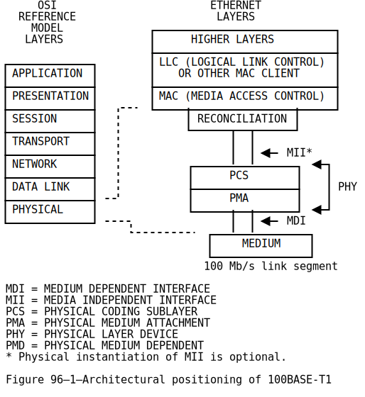

<!--break-->

# BLock

## PHY & MAC

从上到下：

| I/F | 比如PCI总线。负责将IP数据包（或其他协议）传递给MAC层。 |
| MAC | 包含MAC子层和LLC子层。|
| MII/SMI| Media Independed Interfade，介质独立界面。连接MAC和PHY。MAC对PHY的工作状态的确定和对PHY的控制则是使用SMI（Serial Management Interface）界面通过读写PHY的寄存器来完成的。 |
| PHY | 以太网的物理层又包括MII/GMII（介质独立接口）子层、PCS（物理编码子层）、PMA（物理介质附加）子层、PMD（物理介质相关）子层、MDI子层。 对PHY来说，没有帧的概念，都是二进制数据。|
| I/F | 如RJ45。 |

* 当然，肯定还有其他的，什么稳压的、滤波的，就不写在这里了。
* 可以看到，基本上涉及算法的东西应该都在MAC里面。毕竟到了PHY就不能区分协议了。

## 固件与驱动：

* 固件：运行在设备自身的微控制器内部的代码。原则上，应该将尽可能多的功能做入到固件中。只有固件没有驱动才是最完美的。
* 驱动：那些操作系统相关的、无法跨系统共通的、必须独立出来的代码留在驱动中。

## 参考

* [[https://www.cnblogs.com/jason-lu/articles/3195473.html|网口扫盲三:以太网芯片MAC和PHY的关系]]
* [[https://blog.csdn.net/ZCShouCSDN/article/details/80090802|Ethernet（以太网）之一 详解 MAC、MII、PHY]]
* [[https://www.zhihu.com/question/22175660|驱动与固件的区别是什么？]]
